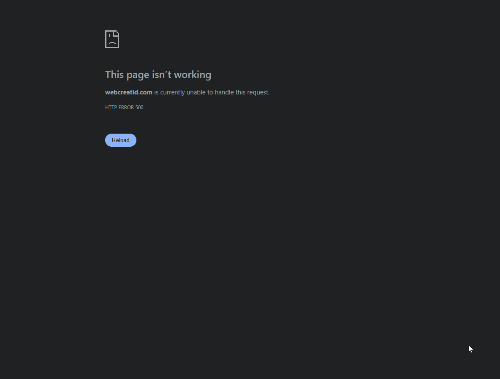

<p align="center">
  
</p>

<h1 align="center">📸 Snap2Link</h1>

<p align="center">
  <strong>Paste screenshots into Claude Code, Cursor, or any terminal AI — in one keystroke.</strong><br/>
  Hotkey → drag a region → public share link lands in your clipboard. Done.
</p>

<p align="center">
  <a href="https://snap2link.app"><strong>🌐 snap2link.app</strong></a>
</p>

<p align="center">
  <a href="https://snap2link.app"></a>
  <a href="https://github.com/amys94fr/Snap2Link/releases/latest"></a>
  <a href="https://github.com/amys94fr/Snap2Link/releases"></a>
  <a href="https://github.com/amys94fr/Snap2Link/stargazers"></a>
  <a href="LICENSE"></a>
  <a href="https://github.com/amys94fr/Snap2Link/actions"></a>
</p>

<p align="center">
  
</p>

---

## Why Snap2Link?

You're working with Claude Code, Cursor, or ChatGPT in a terminal — maybe on a remote VPS, maybe locally — and you need to show the model a UI bug, a design mockup, an error screen. The usual workflow is painful: screenshot, save, open the browser, upload to Imgur or Drive, copy the link, paste it. Every single time.

**Snap2Link collapses that whole sequence into one keystroke.** Hit your hotkey, drag a region, and a public link is already in your clipboard, ready to paste straight into your AI prompt. Uploads go to **your own Google Drive** with the minimum scope possible — no third-party server in the middle, no account to create, no monthly fee.

## ✨ Features

|  |  |
| --- | --- |
| 🤖 **Built for AI workflows** | Paste screenshots into Claude Code, Cursor, ChatGPT, Aider, or any tool that accepts an image URL |
| 🖱️ **Drag-to-capture overlay** | Fullscreen, semi-transparent, live size readout, ESC to cancel |
| ⚡ **Instant share link** | Upload → make public → clipboard, all in the background, < 1 s on broadband |
| ⌨️ **Global hotkey** | Default `Ctrl + Print Screen`, fully rebindable from Settings |
| 🖥️ **Cross-platform** | Windows, macOS, and Linux — single codebase, native everywhere |
| 🗂️ **Auto-cleanup on Drive** | Deletes screenshots older than *N* days (default 30) — your Drive stays tidy |
| 🚀 **Built-in auto-updater** | Signed updates pulled from GitHub Releases — Settings → Check for Updates |
| 🪟 **Start with your OS** | Toggle from Settings — always one keystroke away |
| 🔒 **No third-party server** | OAuth straight to your Drive. Your screenshots, your account, no middleman |
| 🌍 **i18n-ready** | English bundled; add a locale by translating a single JSON file |

## 🚀 Quick Start

```bash
# 1 · Install (see Installation section for your OS)

# 2 · Launch → wizard → "Connect Google Drive" → grant access in your browser

# 3 · Press the hotkey → drag a region → paste anywhere
```

That's it. Three steps, zero configuration.

## 📦 Installation

### Windows

**Via winget** *(recommended, Windows 10+)*

```powershell
winget install snap2link
# or, fully qualified:
winget install amys94fr.Snap2Link
```

**Direct download** — grab the `.exe` installer from the [Releases page](https://github.com/amys94fr/Snap2Link/releases/latest). Windows SmartScreen may flag the binary as *"unrecognised app"* (not yet EV-code-signed) — click **More info → Run anyway**.

### macOS

Download the universal `.dmg` from the [Releases page](https://github.com/amys94fr/Snap2Link/releases/latest), open it, and drag Snap2Link into Applications. A single binary runs natively on both Apple Silicon and Intel.

The app is **not yet notarised**, so the first launch needs a manual override: right-click the app in Finder → *Open* → *Open* in the dialog. Subsequent launches behave normally.

The first capture will prompt for **Screen Recording permission** in System Preferences → Security & Privacy → Screen Recording. Grant it and re-launch.

### Linux

**One-liner install** *(recommended)*

```bash
curl -fsSL https://raw.githubusercontent.com/amys94fr/Snap2Link/main/scripts/install.sh | bash
```

The script detects your distro, picks the right package (`.deb`, `.rpm`, or `.AppImage` as fallback), downloads it from the [latest release](https://github.com/amys94fr/Snap2Link/releases/latest), and installs it. Read it before running if you'd like — it's [in the repo](scripts/install.sh).

**Manual install** — grab the file you want from the [Releases page](https://github.com/amys94fr/Snap2Link/releases/latest):

```bash
# Debian/Ubuntu (resolves dependencies automatically)
sudo apt install ./snap2link_*_amd64.deb

# Fedora/RHEL
sudo dnf install ./snap2link-*.x86_64.rpm

# Any distro (AppImage — portable, no install needed)
chmod +x snap2link_*_amd64.AppImage
./snap2link_*_amd64.AppImage
```

The system tray icon requires `libayatana-appindicator3-1`, which is preinstalled on most desktop environments.

### Build from source

You'll need [Rust](https://rustup.rs/) (stable), [Node.js 20+](https://nodejs.org/), and the Tauri CLI (`cargo install tauri-cli --version "^2"`).

```bash
git clone https://github.com/amys94fr/Snap2Link
cd Snap2Link
npm install
npm run tauri dev      # hot-reload dev build
npm run tauri build    # produces a signed installer in src-tauri/target/release/bundle/
```

## 💡 Use Cases

- **AI prompts** — paste the link directly into Claude Code, Cursor, ChatGPT, or Aider when you need visual context
- **Bug reports** — capture the broken UI, paste the link in Jira / GitHub Issues
- **Design feedback** — share mockup snippets in Slack / Discord / Notion in seconds
- **Documentation** — drop image links straight into READMEs, blog posts, support tickets
- **Remote support** — guide a colleague through their screen without launching a screen-share session
- **Meeting notes** — snap a slide, link it next to your notes, move on with the meeting

## 🔧 Configuration (Google OAuth)

**End users have nothing to configure.** The first launch opens a browser tab on Google's consent page; pick your account; you're done.

**For developers / forks** wanting to ship under their own OAuth credentials:

1. Create a project on [console.cloud.google.com](https://console.cloud.google.com/)
2. Enable the **Google Drive API**
3. Credentials → Create OAuth client → **Desktop application**
4. Download the JSON, rename it `credentials.json`, drop it at the repo root *(gitignored)*
5. `npm run tauri build`

Snap2Link only requests the minimum scopes:

| Scope | Why |
| --- | --- |
| `drive.file` | Read/write **only the files Snap2Link itself creates** — never the rest of your Drive |
| `userinfo.email` | Display the connected account in Settings (so "Switch Account" makes sense) |

## 🛣️ Roadmap

- ✅ Region capture · OAuth Drive · clipboard · auto-cleanup · hotkey · tray
- ✅ Auto-updater (signed releases via GitHub)
- ✅ winget distribution
- ✅ **Cross-platform** — Windows, macOS, Linux
- ✅ **In-app annotations** before upload — pen, rectangle, circle, arrow, text, blur (per-shot Edit / Save prompt)
- ✅ **Full-screen and window-bound capture modes** alongside region selection: switch with `R` / `F` / `W` from the overlay
- 🔜 **History pane** — last *N* screenshots with thumbnails and quick re-share
- 🔜 **More clouds** — Dropbox, OneDrive, S3-compatible
- 🔜 **More locales** — French, Spanish, German, Portuguese …
- 🔜 **Homebrew & Scoop** packages

Got an idea? [Open an issue](https://github.com/amys94fr/Snap2Link/issues/new) — I read every one.

## 🤝 Contributing

PRs welcome. Quick start for contributors:

```bash
git clone https://github.com/amys94fr/Snap2Link
cd Snap2Link
npm install
npm test                            # 77 frontend tests (Vitest)
cd src-tauri && cargo test --lib    # 24 backend tests
```

CI ([`test.yml`](.github/workflows/test.yml)) runs on every push and PR — tests must stay green for a merge.

The full guide (bug reports, feature proposals, coding style, PR checklist) is in **[CONTRIBUTING.md](CONTRIBUTING.md)**. For the release procedure (signing, manifest, GitHub release, winget bump), see **[docs/RELEASE.md](docs/RELEASE.md)**.

### Project layout

```
src/                       React + TypeScript frontend
  windows/                   SetupWizard · Settings · About · Overlay · UploaderToast
  components/                HotkeyRecorder · RetentionControl · UpdateChecker
  i18n/                      i18next + locales/en.json
  store/                     Zustand global state
  lib/keyMap.ts              KeyboardEvent ↔ Tauri shortcut format

src-tauri/                 Rust backend
  src/commands/              auth · config · drive · screenshot · updater
  src/tray.rs                System tray icon + menu
  src/hotkey.rs              Global shortcut registration
  icons/                     App icons (all sizes, generated by `cargo tauri icon`)
```

## 📄 License

[MIT](LICENSE) © 2025 [Steven Abittan](https://github.com/amys94fr).

Built with [Tauri v2](https://v2.tauri.app/), [React](https://react.dev/), [Tailwind CSS](https://tailwindcss.com/), and [Vitest](https://vitest.dev/).
